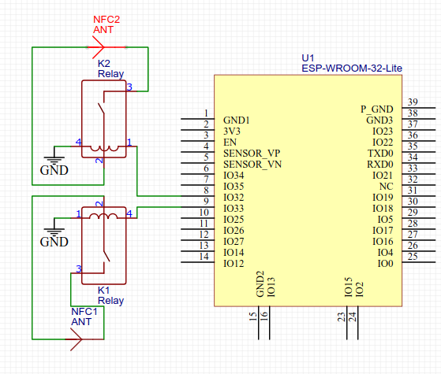

# Scentbysix

This app runs on ESP32, it 

* controls three WS2812 LED rings through serial port
* turns on/off an RFID antenna with an extra Reed Relay

# List of hardware

* ESP32
* A Reed relay which turns on or off by controlling currents through the inputs. In this project we are using `COTO 9007-05-00`, this relay has internal resistance about 500ohm, so it is generally safe to connect to GPIO directly. 

  > This relay has four pins, run a current between pin 1 and 4, pin 2 and 3 will be short-circuited. 


# Configuration

* LED pins and number of LEDs on each strip: 
```cpp
// Configure the pins to control WS2812 LEDs
#define PIN_LED_1 23
#define PIN_LED_2 5
#define PIN_LED_3 16

// Number of LEDs on each WS2812 LED ring
#define NUMPIXELS 24
```

* RFID control PINs:

```cpp
const int numRfidReaders = 2;
// PINs to controls RFID reader, connects to Reed relays
const int rfidPins[numRfidReaders] = {32, 33};
```

* RFID on/off period:
```cpp
#define RFID_PERID 220
```

Sample hardware connection: 



# Server

* [sycreader-nfc](https://github.com/make-studios/sycreader-nfc): the backend receives NFC readings and send to node-red through HTTP
* `node-red-flow/flow.json`: is the node-red flow

